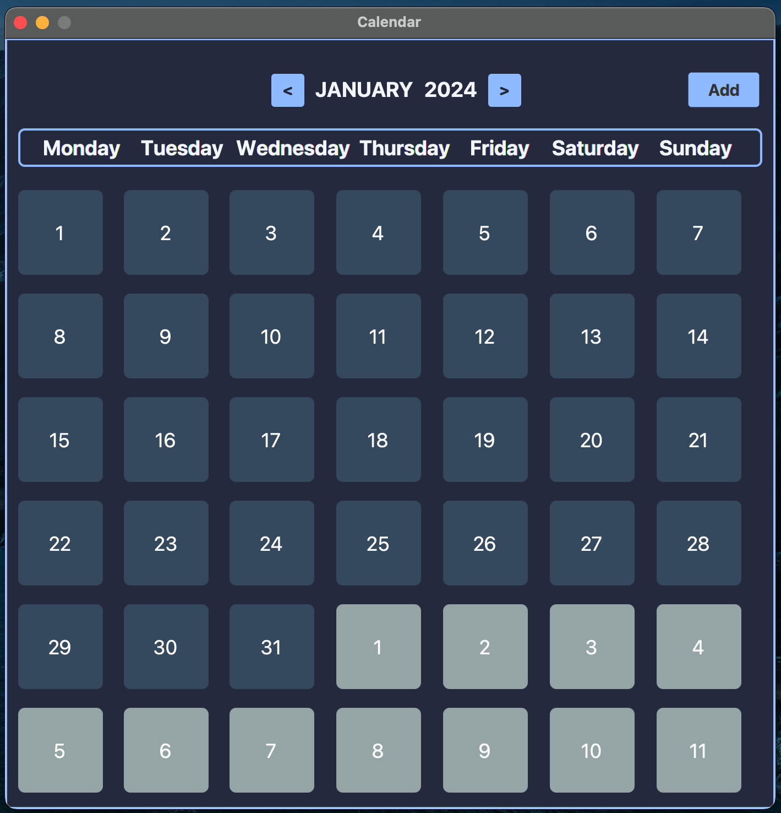

# Calendar

### Introduction

This project is a calendar application developed using JavaFx. It utilizes a SQLite database for data storage and incorporates CSS styling in both the FXML file and Java code.

### Functionalities 

The main view displays a monthly calendar with 42 cells, representing each day of the month, including the preceding and succeeding days. Clicking on a cell opens a daily view showing the events scheduled for that particular day.

To add an event, click on the "Add Event" button. To remove an event, click on the event you wish to delete and then press the remove button. Additionally, you can add events using the "Add" button located in the top right corner of the calendar view.

The event database is stored in the database.db file. I have included an example file with the code, which contains some pre-populated events. Feel free to delete it, so that when you launch the application, it generates a new empty file.

### Licence

This code is released under the [MIT License](LICENSE). Feel free to use, modify, and distribute it as you see fit.

